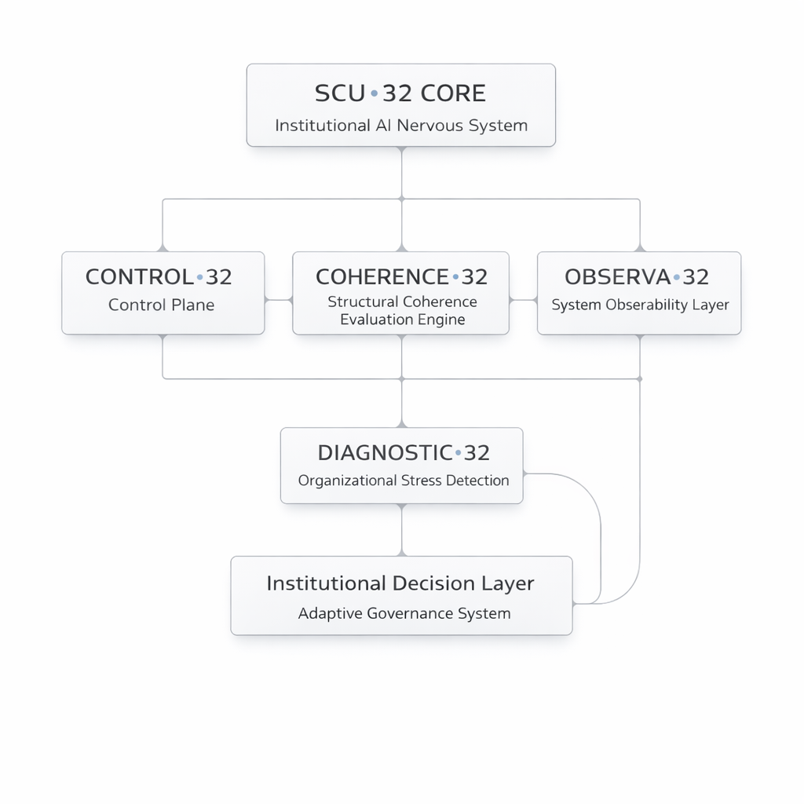

# SCU•32 Framework

Institutional Artificial Nervous Systems  
A Neuro-Inspired Architecture for Adaptive Governance

Author: Amilcar Oliva  
CU Core Technologies LLC  
Intelligent Systems Architecture

---

---

## Overview

SCU•32 proposes a structural architecture for intelligent systems operating across multiple domains of knowledge.

Rather than treating disciplines as isolated areas of expertise, the framework organizes them as interconnected layers within an integrated intelligence ecosystem.

The architecture allows scientific, technical, environmental, institutional, and human systems to be analyzed through a unified structural logic.

---

## Core Concept

Modern systems — institutions, organizations, infrastructures, and scientific domains — behave as complex adaptive networks.

SCU•32 models these systems using a structure inspired by biological nervous systems:

• Observation  
• Viability  
• Emergence  
• Coherence  
• Implementation  
• Institutional Integration

---

## Domain Architecture

### Human & Health Systems
MEDIC•32  
DERM•32  
PSYCHE•32  
HESTIA•32  
NATURA•32  
BIO•32  

### Built Environment
ARCHITECT•32  
CIVIL•32  

### Digital & Institutional Systems
CYBER•32  
LEGAL•32  
DATA•32  

### Environmental Systems
EIRENE•32  

### Creative Systems
LUMINA•32  

### Knowledge Systems
EDU•32  

### System Integration
SYSTEM•32  

---

## Status

Architecture under active development.

Public release scheduled: March 26

---

## Author

Amilcar Oliva  
CU Core Technologies LLC  
Intelligent Systems Architecture
