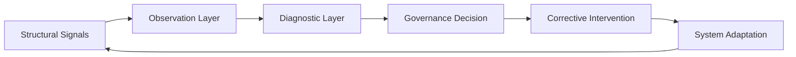
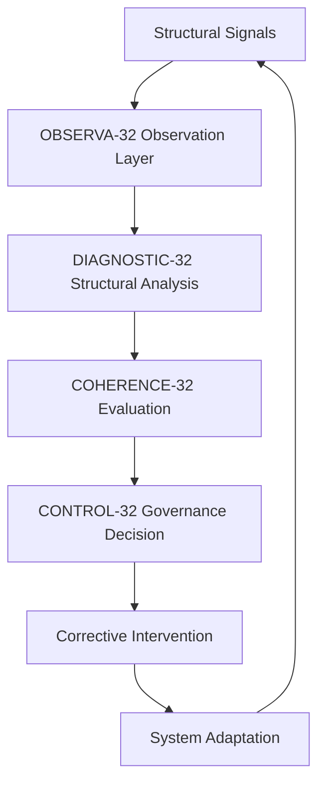

# SCU•32

Structural Coherence Architecture for Adaptive Systems

SCU-32 is a coherence-based research architecture for understanding, diagnosing, and governing complex institutional systems.

The framework models organizations, institutions, and large-scale socio-technical environments as adaptive systems that maintain stability through continuous feedback, signal interpretation, and corrective intervention.

Instead of treating failure as an isolated event, SCU-32 analyzes how structural stress accumulates inside systems and how institutions can detect and correct drift before systemic breakdown occurs.

The architecture introduces the concept of an **Institutional Artificial Nervous System** — a governance layer capable of sensing structural signals, interpreting system conditions, and coordinating corrective action across institutional structures.

---

## Core Idea

Complex systems rarely collapse suddenly.

They drift.

Signals weaken.  
Incentives diverge.  
Correction slows down.

When correction latency exceeds the system's tolerance, instability emerges.

SCU-32 formalizes this dynamic through a framework that integrates:

• structural signal detection  
• coherence evaluation  
• governance response  
• adaptive intervention

---

## System Control Loop

This diagram illustrates the feedback loop through which SCU-32 detects structural drift, interprets system signals, and coordinates corrective intervention.

---

## SCU-32 System Architecture

This diagram shows the layered architecture through which SCU-32 interprets structural signals, evaluates system coherence, and coordinates governance responses across institutional systems.

---

## Conceptual Model

SCU-32 treats institutions as **adaptive systems operating under coherence constraints**.

Stability emerges when signals are correctly interpreted and corrective action remains within the system's response window.

Instability appears when signal detection weakens, decision latency increases, or incentives diverge from system objectives.

The framework therefore focuses on:

• early signal detection  
• structural diagnostics  
• coherence monitoring  
• governance intervention

---

## Research Direction

SCU-32 explores the development of institutional architectures capable of maintaining coherence in increasingly complex socio-technical environments.

Future research directions include:

• coherence metrics for institutional systems  
• governance control loops  
• early-warning indicators of systemic drift  
• institutional artificial nervous systems
