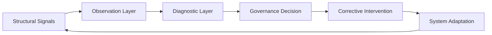

# SCU•32  
SCU-32 is a coherence-based research architecture for understanding, diagnosing, and governing complex institutional systems.

The SCU-32 framework models organizations, institutions, and large-scale socio-technical environments as adaptive systems that maintain stability through continuous feedback, signal interpretation, and corrective intervention.

Instead of treating failure as an isolated event, SCU-32 analyzes how structural stress accumulates inside systems and how institutions can detect and correct drift before systemic breakdown occurs.

The architecture introduces the concept of an Institutional Artificial Nervous System — a governance layer capable of sensing structural signals, interpreting system conditions, and coordinating corrective action across institutional structures.

---

## Core Idea

## System Control Loop

Complex systems rarely collapse suddenly.

They drift.

Signals weaken.  
Incentives diverge.  
Correction slows down.

When correction latency exceeds the system’s tolerance, instability emerges.

SCU•32 formalizes this dynamic through a framework that integrates:

• structural signal detection  
• coherence evaluation  
• governance response  
• corrective feedback loops  

The goal is not simply to analyze systems, but to create architectures that preserve institutional coherence under accelerating environmental change.

---

## Core Papers

The framework is described through three foundational papers.

### Institutional Artificial Nervous System

Architecture for adaptive institutional governance.

This paper describes how institutions can be modeled as systems that sense structural signals, interpret environmental conditions, and execute corrective action through a closed-loop architecture.

Location:

[Institutional Artificial Nervous System](papers/institutional-artificial-nervous-system.md)

---

### Structural Signal Taxonomy

Operational classification of signals that reveal structural stress inside complex systems.

These signals form the input layer of the institutional nervous system and allow early detection of institutional drift.

Location:

[Structural Signal Taxonomy](papers/structural-signal-taxonomy.md)

---

### Correction Latency Model

Mathematical model describing the relationship between:

• signal detection  
• decision latency  
• corrective intervention  
• systemic stability  

The model formalizes how delayed responses can push systems outside their stability domain.

Location:

[Correction Latency Model](papers/scu32-correction-latency-model.md)

---

## System Architecture

The SCU•32 architecture functions as a closed-loop adaptive governance system composed of several functional engines.

These engines coordinate detection, analysis, and correction.

Conceptually the architecture can be represented as:

Signals → Observation → Diagnosis → Governance → Correction → Feedback

The system continuously monitors structural conditions and adjusts institutional behavior through feedback mechanisms.

Further architectural details are documented in:

ARCHITECTURE.md  
SYSTEM-32.md

---

## Repository Structure

SCU-32  
│  
├── papers  
│   ├── institutional-artificial-nervous-system.md  
│   └── structural-signal-taxonomy.md  

├── diagrams  

├── docs  

├── ARCHITECTURE.md  
├── SYSTEM-32.md  
├── README.md  
├── LICENSE  

---

## Research Scope

SCU•32 explores how coherence-based architectures can improve stability across complex environments such as:

• institutions  
• organizations  
• AI governance systems  
• socio-technical infrastructures  
• large distributed decision networks  

The framework draws conceptual inspiration from:

• systems theory  
• cybernetics  
• control theory  
• biological regulatory systems  
• institutional governance research  

---

## Conceptual Foundations

Three structural principles guide the architecture.

### Coherence

Systems remain stable when their internal signals, incentives, and governance mechanisms remain aligned.

### Boundaries

Every adaptive system operates within a domain of structural validity.

Beyond that domain, correction mechanisms lose effectiveness.

### Correction

The speed and accuracy of corrective response determine whether the system recovers stability or enters systemic drift.

---

## Future Development

Current work focuses on expanding the framework in several directions:

• diagnostic engines for institutional drift detection  
• real-time governance feedback architectures  
• coherence measurement metrics  
• computational modeling of institutional stress dynamics  

---

## Author

Amilcar Oliva  
Architectural Research on Coherence-Based Systems

---

## License

See the LICENSE file for usage terms.
